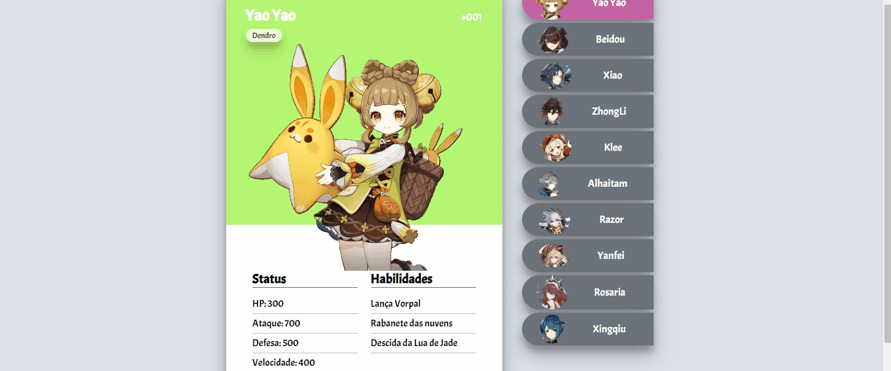
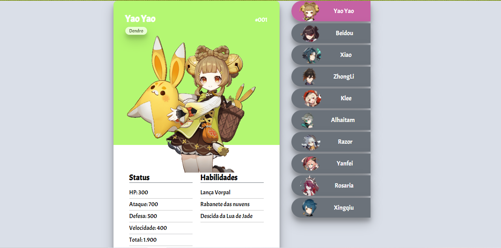

Neste repositório montei um projeto em uma espécia de "pokedex" onde constam cartas com habilidades e informações de personagens (meramente ilustrativas) do jogo Genshin Impact.

Escolhi meus 10 melhores personagens. Cada um com uma carta específica com suas informações, img e fundo correspondentes ao seu elemento.

##Em Funcionamento:

[]

Cada clique em um personagem específico da listagem lateral leva o usuário a carta respectiva do personagem.

[]

##Tecnologias usadas:

-HTML
-CSS
-JavaScript

##Maiores desafios:

A composição do JavaScript tem ficado mais clara para mim com o passar do tempo. Tive apenas um pouco de dificuldade de gerenciar todas as class e id's criados. NOTA PARA MIM MESMA: Lembrar de prestar atenção em nomes que mudam poucas letras como cartao e cartoes.
Tive alguma dificuldade no responsivo quanto a adaptação do tamanho da tela no notebook.
